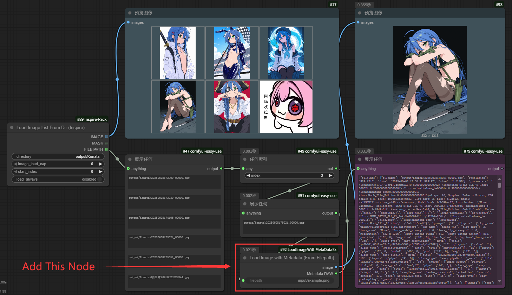

# ComfyUI-LoadImageWithMetaDataEx

Custom node for ComfyUI. It can read metadata from the image filepath, and filepath can be provided as a connected input, which allows it to batch read image metadata in a loop.

Most of the source code is copied from https://github.com/crystian/ComfyUI-Crystools, with only minor modifications made by me.

## Input

``filepath``: Only string, can't input string list.

## Output

``image``: Image

``Metadata RAW``: The Same as ``Metadata RAW`` in Crystools' ``Load Image With Metadata`` node.

